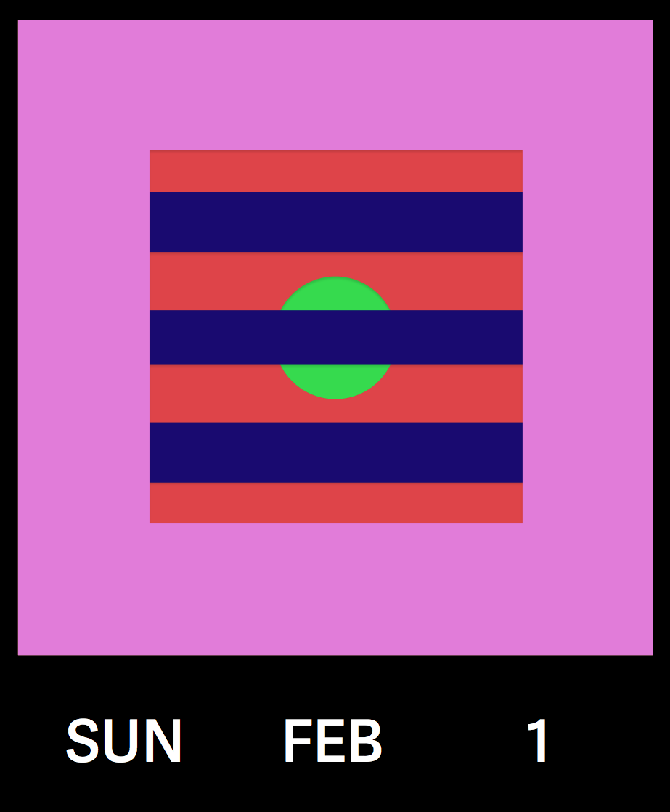
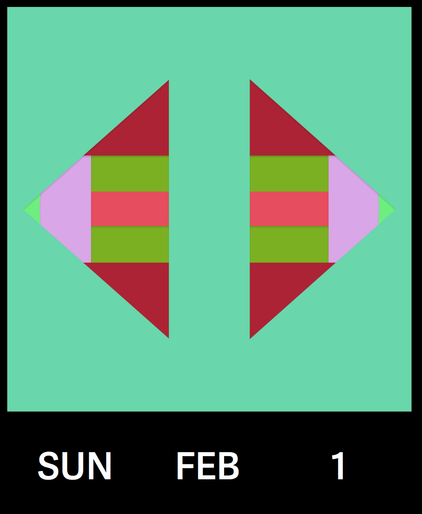

# perpetual-calendar



A neat web based calendar with semi-randomly generated covers based on the 1987 MoMA [Perpetual Wall Calendar][moma] designed by [Dan Reisinger][dan].

In some ways it’s better than the paper-based original:

- Updates itself every morning
- More colors, more feels
- Responsive (to your needs)
- Your emotional needs.

[View live][project]



## To build locally

### First install some stuff

```bash
$ npm install -g stylus
$ npm install -g autoprefixer-stylus
$ npm install -g http-server
```

### Then run these

Each of these get their own `terminal`

```bash
$ stylus -u autoprefixer-stylus --watch css/styles.styl
$ http-server -p 4040
```

### Good times ahead

Go to `http://localhost:4040`

🏩

[moma]:http://www.momastore.org/museum/moma/ProductDisplay?storeId=10001&catalogId=10451&langId=-1&categoryId=11526&parent_category_rn=26674&productId=164102&keyWord=Perpetual%20Wall%20Calendar&purpose=crawl
[dan]:http://www.google.com/url?sa=t&rct=j&q=&esrc=s&source=web&cd=2&cad=rja&uact=8&ved=0CCYQFjAB&url=http%3A%2F%2Fen.wikipedia.org%2Fwiki%2FDan_Reisinger&ei=ZGnOVOD1K4HSggSXw4C4DQ&usg=AFQjCNFcWW9T8s2MyeETAoJgToMmwBSDmA&sig2=GowrpeNUN2CX6crhw-u_fw&bvm=bv.85076809,d.eXY
[project]:http://pketh.org/perpetual-calendar/
